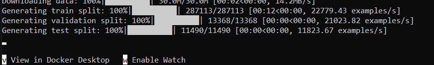

# NLU demo

This repository contains a demo application for Natural Language Understanding (NLU) tasks: text summarization and text retrieval. The model leverages the hidden state of the encoder for both functionalities.

## Key feature
- Text Summarization: Provides a summary of a given text input.
- Text Retrieval: Searches for related text based on the hidden representation learned by the encoder. (Note: The demo using an already-calculated database since doing this task in real-time on a personal computer is too time-consuming).

## Tech Stack:

Frontend: Next.js.
Backend: Django.
Deep Learning Framework: PyTorch
Containerization: Docker

### Project Structure:

```client```: Next.js application for user interface and interacting with the backend. (Contains Dockerfile)
```backend```: Django application implementing the summarization and retrieval logic. (Contains Dockerfile)
```docker-compose.yml```: Configures and runs both client and backend containers together.
```run.bat```: Windows script for easy project startup.

## Getting Started:
### With docker
1. Install Docker and Docker Compose according to their official documentation.
2. Getting this repository on your local machine.
2. (If cloning from github) Get the data and model files for the server. The files are provided [here](https://drive.google.com/drive/folders/1ThR-hCepbC2jf5R23rR7fvocPuDaN86h?usp=sharing) and [here](https://drive.google.com/file/d/1sL7A8IK59jj75mEOxuGJncUG6-r2ZnLI/view?usp=sharing).
3. Run ```docker compose up``` to start both client and backend services.
3. (Optional) Run the run.bat file for a quick launch.

Note: The server takes a long time to run (probably up to 10 minutes to finalize thing) so please kindly wait for it. Most of the time, it'll finish when there's a line indicate that the data is finishedly prepared like this.


### Without docker
#### Frontend
1. Install neccessary library with ```npm install``` or ```yarn install```.
2. For fast build, run ```npm run dev``` or ```yarn dev```.
3. For longer but more stable build, run ```npm run build``` or ```yarn build```, and then ```npm run start``` or ```yarn start```.
#### Backend
Note: We don't exactly know how to do this in a more proper way, so this is our (or my) attempt at replicate it.
1. Prepare a virtual environment for our program using Python 3.9. We recommend Anaconda or virtualenv.
2. Remove the 3 torch-related package in the ```requirements.txt```, which are ```torch```, ```torchaudio``` and ```torchvision```.
3. Install torch separately. You can install torch normally, or try to install torch with gpu following this.
4. Install the rest using ```pip install -r requirements.txt```.
4. (If cloning from github) Get the data and model files for the server. Please look at the above section for more details.
5. Run the server with ```python manage.py runserver```.

### Demo


### Further Development:
- Experiment with different deep learning architectures for summarization and retrieval.
- Fix the copy the hidden state feature when run in a container: For some reason, running with docker makes the feature useless.
- Add a more appeal way to visualize the nlu.

### Note:
This is a basic example. Feel free to add or remove file to your content if you know what you do. Don't be us. Or me, my partner is cool tbh.